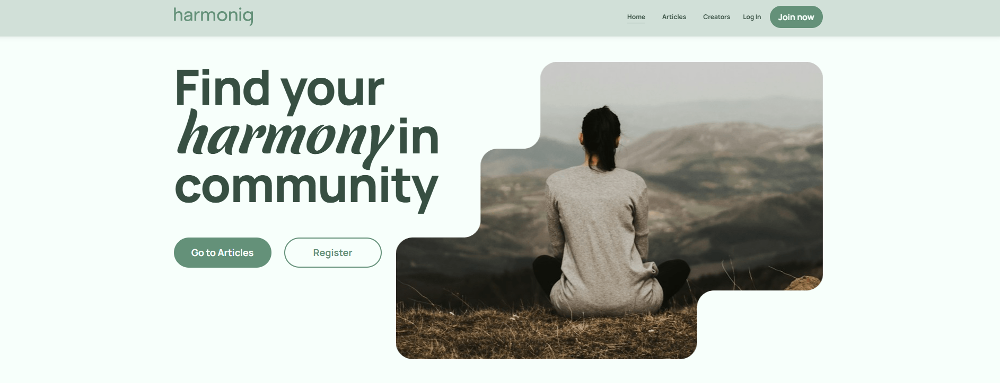
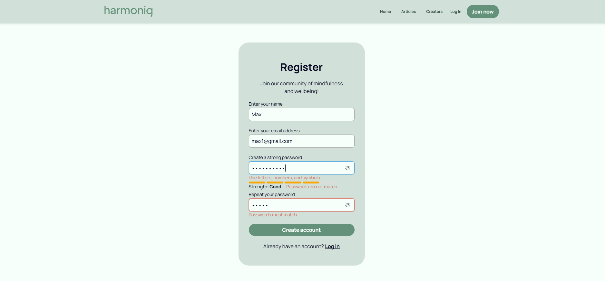
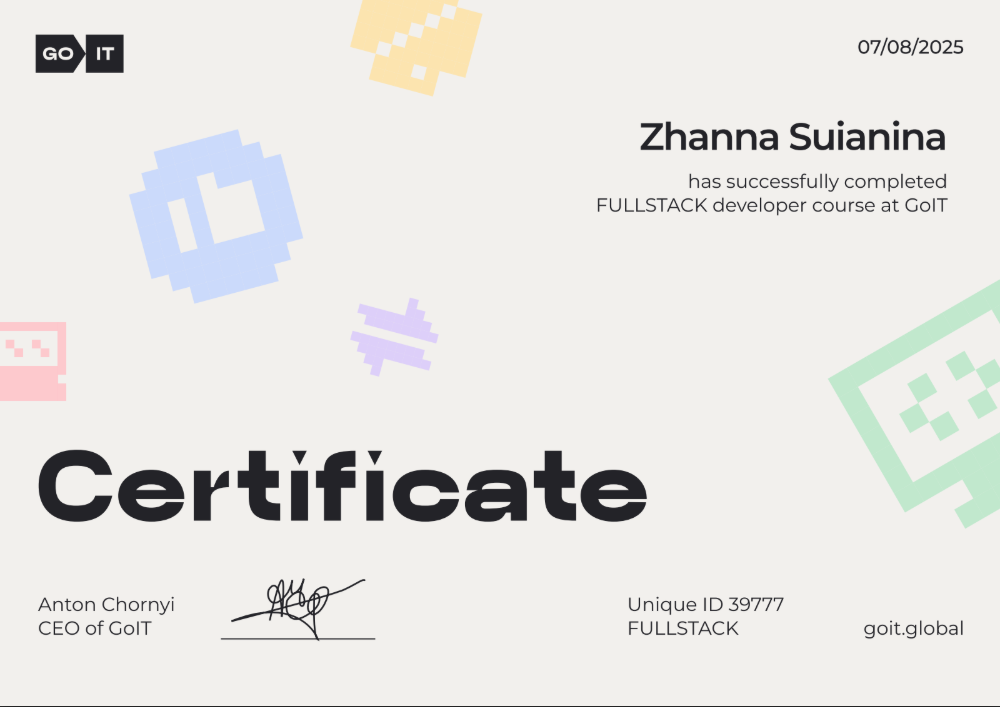
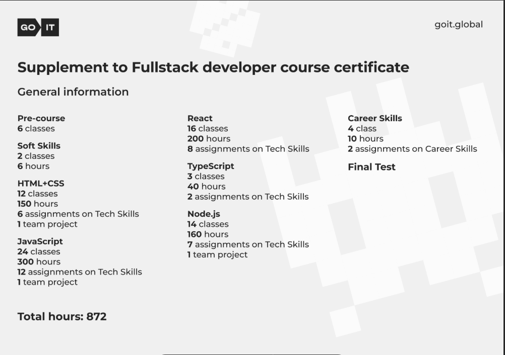
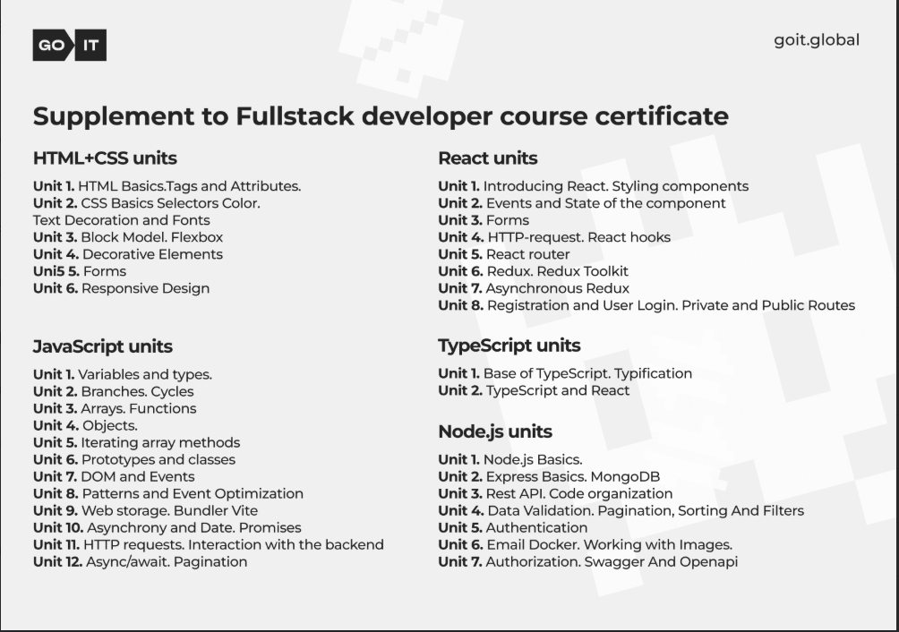

# Hey there, I'm <strong>Zhanna!</strong> 👋

Crafting responsive, accessible, and high-quality web applications  
with clean architecture and a user-first mindset.

---

## About Me

- Specializing in **React**, **TypeScript**, UI development  
- Focused on **clean code**, **scalability**, and modern best practices  
- Experienced with both **frontend** and **backend**  
- Constant learner: improving TypeScript, testing & advanced React  
- I enjoy building interfaces that feel intuitive, smooth, and meaningful

---

## My Stack and Tools

<table>
  <tr>
    <td align="center">
       
      HTML5
    </td>
    <td align="center">
       
      CSS3
    </td>
    <td align="center">
       
      JavaScript
    </td>
    <td align="center">
       
      TypeScript
    </td>
    <td align="center">
       
      React.js
    </td>
   <td align="center">
       
      Node.js
    </td>
    <td align="center">
       
      Sass
    </td>
    <td align="center">
       
      Redux
    </td>
    <td align="center">
       
      Postman
    </td>
    <td align="center">
       
      MongoDB
    </td>
  </tr>
</table>

---

## Featured Projects

### **Movie Search**

🔗 **Live**: https://goit-react-hw-05-rho-one-90.vercel.app 
🔗 **Code**: https://github.com/Suianina/goit-react-hw-05  

Single-page movie search application using the TMDB API. 
Features dynamic routing, lazy loading, cast & reviews pages, asynchronous requests, responsive interface, and polished UX. 
**Tech:** React.js, JavaScript, Axios, React Router, REST API, HTML5, CSS3, Vercel 
**Role:** Developer

---

### **Traveltrucks Camper Rental**

🔗 **Live**: https://traveltrucks-camper-rental.vercel.app/ 
🔗 **Code**: https://github.com/Suianina/traveltrucks-camper-rental  

Camper rental platform with advanced filtering, favorite system, and modern responsive design. 
**Tech:** React.js, React Router, Styled Components, REST API, Vercel 
**Role:** Front-End Developer

---

### **HarmonyQ — Mental Well-being Social Network**

🔗 **Frontend**: https://mindflow-frontend.vercel.app/ 
🔗 **Backend**: https://github.com/Suianina/mindflow-backend 
🔗 **Frontend Code**: https://github.com/Suianina/mindflow-frontend  

A full-stack social network for mental well-being with authentication, content creation, photo uploads, and responsive design. 
**Tech:** React, Redux Toolkit, Node.js, Express, MongoDB, REST API 
**Role:** Full-Stack Developer 
Backend: auth & Swagger docs 
Frontend: RegisterPage & RegisterForm

---

## Certifications

### FullStack Developer Certificate
**GoIT School** • 07/08/2025

  
[View Certificate](https://drive.google.com/file/d/1fWSUTchdHMetLdaewMUyK2caAvG9cXBR/view?usp=sharing)

---

## Languages

---

## Connect with me

[LinkedIn](https://www.linkedin.com/in/zhanna-suianina-0515b4353/)  
[Telegram](https://t.me/Zhanna_suianina)  
[Email](mailto:zhannasuianina@gmail.com)  

---

## GitHub Stats

---

Thank you for visiting my profile!  
Let's build something meaningful together.

